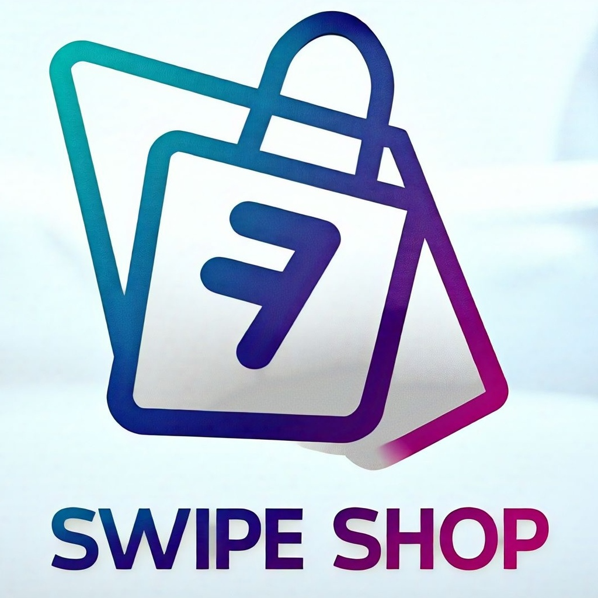

<div align="center">
  
</div>

# Swipe Shop

A modern e-commerce application built with React, TypeScript, and Vite that features a Tinder-like swiping interface for product discovery.

## 🚀 Features

- Tinder-style product swiping interface
- Modern and responsive UI built with Tailwind CSS
- Cross-platform support with Capacitor for Android
- Smooth animations using React Spring
- Type-safe development with TypeScript
- Hot reloading for fast development

## 🛠️ Tech Stack

- **Frontend Framework:** React 19
- **Language:** TypeScript
- **Build Tool:** Vite
- **Styling:** Tailwind CSS
- **Mobile:** Capacitor
- **Animations:** React Spring
- **Routing:** React Router
- **UI Components:** React Icons
- **Notifications:** React Hot Toast

## 📦 Installation

1. Clone the repository:

```bash
git clone https://github.com/yourusername/swipe-shop.git
cd swipe-shop
```

2. Install dependencies:

```bash
npm install
```

3. Start the development server:

```bash
npm run dev
```

4. Build for production:

```bash
npm run build
```

## 🚀 Development

The application runs on port 3000 by default. You can access it at `http://localhost:3000`.

### Available Scripts

- `npm run dev` - Start development server
- `npm run build` - Build for production
- `npm run lint` - Run ESLint
- `npm run preview` - Preview production build

## 📱 Mobile Development

This project uses Capacitor for mobile development. To set up and run the Android emulator with live reloading:

### Prerequisites

1. Install [Android Studio](https://developer.android.com/studio)
2. Install Android SDK and create an Android Virtual Device (AVD) through Android Studio
3. Make sure you have Java Development Kit (JDK) installed

### Setup and Live Reloading

1. First, build your web app:

```bash
npm run build
```

2. Add Android platform to your project:

```bash
npx cap add android
```

3. Sync your web app with Android project:

```bash
npx cap sync android
```

4. Open Android Studio:

```bash
npx cap open android
```

5. In Android Studio:

   - Select your AVD from the device dropdown
   - Click the "Run" button (green play icon) to start the emulator

6. For live reloading during development:
   - Start the Vite development server:
   ```bash
   npm run dev
   ```
   - In a new terminal, run:
   ```bash
   npx cap run android --live-reload
   ```
   This will open your app in the emulator and automatically reload when you make changes to your code.

### Building APK for Personal Use

To build a debug APK for personal use and testing:

1. First, build your web app:

```bash
npm run build
```

2. Sync with Android:

```bash
npx cap sync android
```

3. Build the debug APK:

```bash
cd android
./gradlew assembleDebug
```

The debug APK will be generated at:

```
android/app/build/outputs/apk/debug/app-debug.apk
```

You can install this APK on your Android device by:

1. Transferring the APK file to your device
2. Opening the file on your device
3. Allowing installation from unknown sources if prompted
4. Following the installation prompts

Note: This debug APK is suitable for personal use and testing, but cannot be published to the Play Store.

### Common Issues and Solutions

1. If you get a "Could not find or load main class" error:

   - Make sure you have the correct JDK version installed
   - Set JAVA_HOME environment variable

2. If the app doesn't reload automatically:

   - Make sure your development server is running
   - Check if the emulator is properly connected
   - Try restarting the development server

3. If you make changes to native code:
   - Run `npx cap sync android` to sync the changes
   - Restart the app in the emulator

## 🤝 Contributing

Contributions are welcome! Please feel free to submit a Pull Request.
